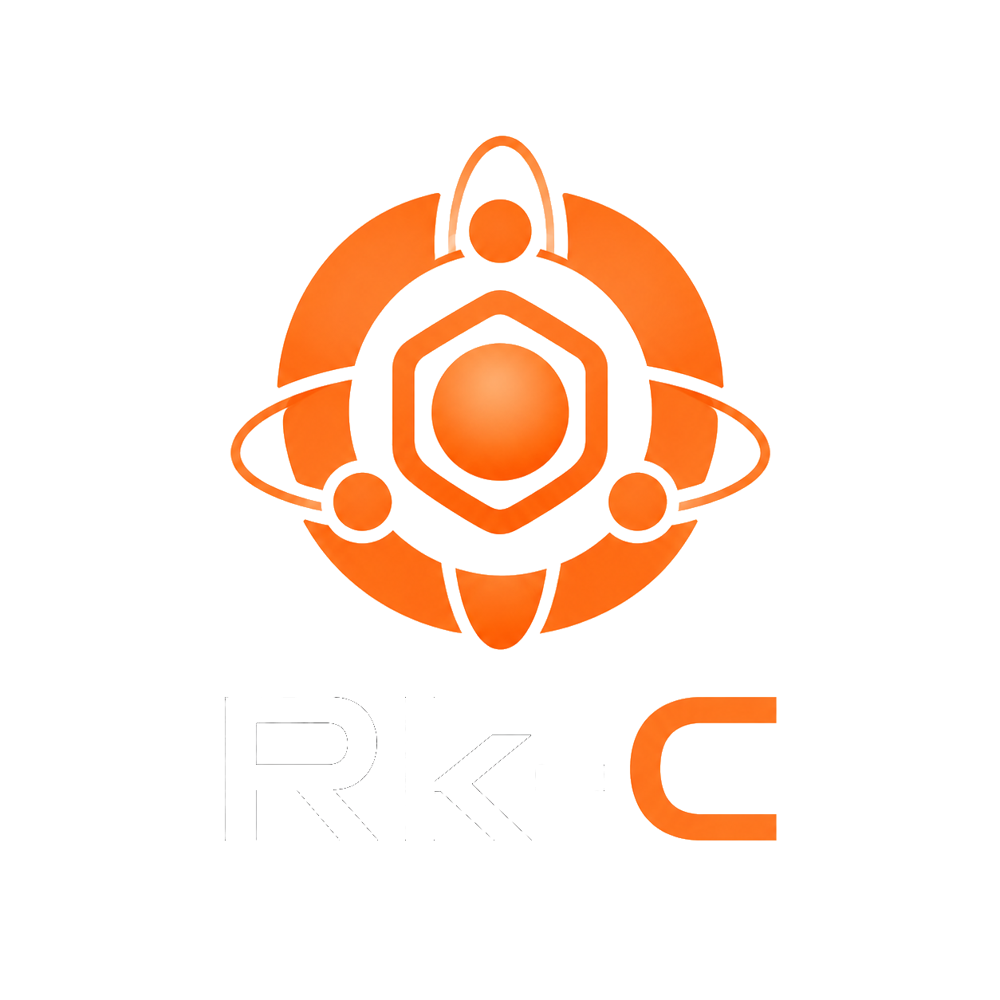
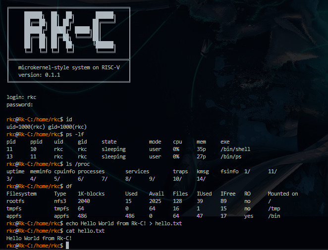

<p>
  
</p>

Rk-C is an experimental RISC-V 64-bit microkernel prototype written mainly in Nim.

It keeps the S-mode kernel small and moves policy and device-facing behavior into isolated U-mode services. The system currently boots on QEMU `virt` with OpenSBI, runs protected U-mode processes, provides a shell-driven userland, and includes filesystem, service, process, account, and networking components.

<!-- RKC_VERSION_START -->
Current version: `0.1.2`
<!-- RKC_VERSION_END -->



## Overview

Rk-C is a learning and research operating system project focused on microkernel-style design on RISC-V.

The kernel provides the privileged core:

* boot and trap handling
* syscall dispatch
* Sv39 virtual memory
* scheduling
* IPC transport
* service registry
* VirtIO MMIO device support
* RKX executable loading

Most higher-level behavior is implemented in U-mode services and applications, including:

* process management
* service management
* filesystem and block services
* procfs-like runtime information
* user and account services
* networking services
* shell and command-line applications

Design notes are available under [`docs/design`](docs/design/README.md).

## Highlights

* **RISC-V 64-bit microkernel prototype** built mainly in Nim.
* **Runs on QEMU `virt` with OpenSBI**.
* **Small S-mode kernel** with isolated U-mode services.
* **Userland service model** with registry-based IPC.
* **RKX executable format** for user applications.
* **Shell-driven user environment** with command binaries.
* **Disk-backed root filesystem** with `/tmp` and `/proc`.
* **Unix-like accounts and permissions**.
* **VirtIO MMIO networking** with IPv4, DNS, TCP, HTTP client support, and an experimental TLS 1.3 path.
* **Smoke tests** for kernel, IPC, filesystem, services, user apps, and networking behavior.
* **Canonical Workshop support** for reproducible local development.

## Repository Layout

```text
src/
  arch/riscv64/        RISC-V assembly and CSR/SBI helpers
  kernel/              Kernel implementation
  lib/                 Shared kernel/user ABI types and helpers
  user/
    apps/              User commands and test-only apps
    lib/               User runtime, syscall, IPC, and protocol helpers
    server/            Userland servers

scripts/
  make_rkx.py          Converts user ELF files into RKX images
  pack_appfs.py        Packs RKX images into the disk image
  test_apps.py         Boots QEMU and smoke-tests user apps

docs/
  design/              Subsystem design notes
  review/              Review notes and follow-up checklists

.workshop/
  rkc-dev.yaml         Main Nim + QEMU development workshop
  rkc-actions.yaml     Local GitHub Actions workflow check workshop
```

## Local Development and Runtime Test

The recommended development environment is Canonical [Workshop](https://ubuntu.com/workshop).

Rk-C uses two local workshops:

* `rkc-dev`: main development, build, run, QEMU, and smoke-test environment
* `rkc-actions`: local GitHub Actions workflow check environment using `act`

Install LXD and Workshop:

```bash
sudo snap install --channel=6/stable lxd
sudo snap install --classic workshop
```

Launch the main development workshop:

```bash
workshop launch rkc-dev
```

Check the workshop status:

```bash
workshop list
```

Expected result:

```text
WORKSHOP  STATUS  NOTES
rkc-dev   Ready   -
```

### Build

```bash
workshop run rkc-dev -- build
```

### Build user binaries

```bash
workshop run rkc-dev -- build-bins
```

### Run

```bash
workshop run rkc-dev -- run
```

Initial user accounts:

```text
username: root, password: root
username: rkc,  password: rkc
```

### Test

```bash
workshop run rkc-dev -- test
```

The test action runs the QEMU app smoke test suite with QEMU user networking.

### Debug

Start QEMU paused with a GDB server:

```bash
workshop run rkc-dev -- debug
```

### Clean

```bash
workshop run rkc-dev -- clean
```

## Local GitHub Actions Workflow Check

The `rkc-actions` workshop is used to check GitHub Actions workflows locally.

This workshop is intentionally separate from `rkc-dev` so that Docker and local workflow-check tooling do not pollute the main Nim + QEMU development environment.

Launch the workflow-check workshop:

```bash
workshop launch rkc-actions
```

List available workflow jobs:

```bash
workshop run rkc-actions -- list
```

Check the workflow locally:

```bash
workshop run rkc-actions -- check-workflow
```

This uses `act` to run the GitHub Actions workflow locally.

The local check is intended to validate workflow wiring, including:

* workflow syntax
* event selection
* job ID selection
* `ACT`-specific branch behavior
* checkout behavior
* artifact step wiring

The full QEMU smoke test is skipped under local `act`. Run the real test with:

```bash
workshop run rkc-dev -- test
```

## Shell Examples

```text
Rk-C:/$ help
Rk-C:/$ svc status
Rk-C:/$ ps -l
Rk-C:/$ ls /proc
Rk-C:/$ rkxinfo curl
Rk-C:/$ date > /tmp/now.txt
Rk-C:/$ cat /tmp/now.txt | cat
Rk-C:/$ ping 10.0.1.1
Rk-C:/$ curl http://example.com/
Rk-C:/$ shutdown
```

## Notes

* Rk-C is a learning and research kernel, not a production OS.
* The ABI and internal service protocols are still evolving.
* The HTTPS/TLS path does not validate certificates yet.
* The network stack is intentionally small and experimental.
* The generated Workshop lock file should not be committed:

```text
.workshop.lock
```

If a Workshop definition or project-local SDK changes, refresh the relevant workshop:

```bash
workshop refresh rkc-dev
workshop refresh rkc-actions
```
