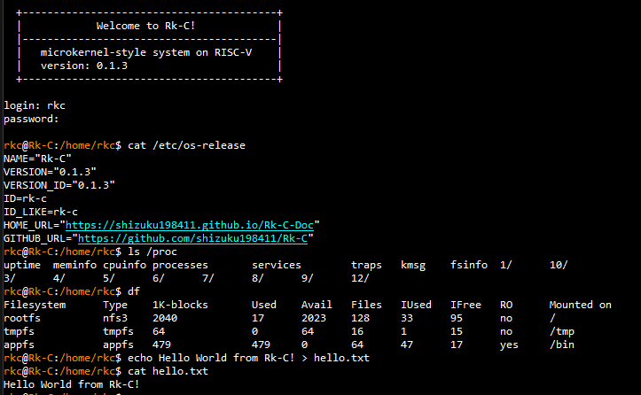

<p>
  
</p>

Rk-C is an experimental RISC-V 64-bit microkernel prototype written mainly in Nim.

It keeps the S-mode kernel small and moves policy and device-facing behavior into isolated U-mode services. The system boots on QEMU `virt` with OpenSBI and also has an experimental Milk-V Duo 256M bring-up path. It runs protected U-mode processes, provides a shell-driven userland, and includes filesystem, service, process, account, and networking components.

<!-- RKC_VERSION_START -->
Current version: `0.1.3`
<!-- RKC_VERSION_END -->



## Overview

Rk-C is a learning and research operating system project focused on microkernel-style design on RISC-V.

The kernel provides the privileged core:

* RISC-V 64-bit boot and trap handling
* syscall dispatch
* Sv39 virtual memory
* preemptive scheduling foundation
* IPC transport
* service registry
* platform-specific console, timer, block, MMIO, and memory-layout backends
* RKX executable loading

Most higher-level behavior is implemented in U-mode services and applications, including:

* process management
* service management
* filesystem and block services
* procfs-like runtime information
* user and account services
* networking services
* shell and command-line applications

## Highlights

* **RISC-V 64-bit microkernel prototype** built mainly in Nim.
* **QEMU `virt` target** using OpenSBI, VirtIO block, and VirtIO net.
* **Milk-V Duo 256M target** using the board's OpenSBI/U-Boot boot flow, UART console, and SD-backed block access.
* **Small S-mode kernel** with isolated U-mode services.
* **Userland service model** with registry-based IPC.
* **RKX executable format** for user applications.
* **Shell-driven user environment** with command binaries.
* **Disk-backed root filesystem** with `/tmp`, `/proc`, and `/bin` appfs.
* **Unix-like accounts and permissions**.
* **VirtIO MMIO networking on QEMU** with IPv4, DNS, TCP, HTTP client support, and an experimental TLS 1.3 path.
* **Smoke tests** for kernel, IPC, filesystem, services, user apps, and networking behavior.
* **Canonical Workshop support** for reproducible local development.

## Supported Targets

| Target | Status | Notes |
| --- | --- | --- |
| QEMU `virt` | Main development target | Uses OpenSBI, VirtIO block, and VirtIO net. |
| Milk-V Duo 256M | Experimental real-hardware target | Uses the vendor FSBL/OpenSBI/U-Boot boot chain and an Rk-C FIT image. |

## Repository Layout

```text
src/
  arch/riscv64/        RISC-V assembly and CSR/SBI helpers
  kernel/              Kernel implementation
  lib/                 Shared kernel/user ABI types and helpers
  platform/            Target-specific platform backends
  user/
    apps/              User commands and test-only apps
    lib/               User runtime, syscall, IPC, and protocol helpers
    server/            Userland servers

scripts/
  make_rkx.py          Converts user ELF files into RKX images
  pack_appfs.py        Packs RKX images into appfs/disk images
  test_apps.py         Boots QEMU and smoke-tests user apps

docs/
  qemu.md              QEMU build and execution guide
  milkv-duo256m.md     Milk-V Duo 256M real-hardware execution guide
  testing.md           Test execution guide
  design/              Subsystem design notes

.workshop/
  rkc-dev.yaml         Main Nim + QEMU development workshop
  rkc-actions.yaml     Local GitHub Actions workflow check workshop
```

## Documentation

* [QEMU environment execution guide](docs/qemu.md)
* [Milk-V Duo 256M real-hardware execution guide](docs/milkv-duo256m.md)
* [Test execution guide](docs/testing.md)
* [Design notes](docs/design/README.md)

## Userland Examples

```text
Rk-C:/$ help
Rk-C:/$ svc status
Rk-C:/$ ps -l
Rk-C:/$ ls /proc
Rk-C:/$ rkxinfo curl
Rk-C:/$ date > /tmp/now.txt
Rk-C:/$ cat /tmp/now.txt | cat
Rk-C:/$ ping 10.0.1.1
Rk-C:/$ curl http://example.com/
Rk-C:/$ shutdown
```

## Notes

* Rk-C is a learning and research kernel, not a production OS.
* The ABI and internal service protocols are still evolving.
* The HTTPS/TLS path does not validate certificates yet.
* The network stack is intentionally small and experimental.
* Milk-V Duo 256M support is an experimental hardware bring-up path.

## License

See [LICENSE](LICENSE).
