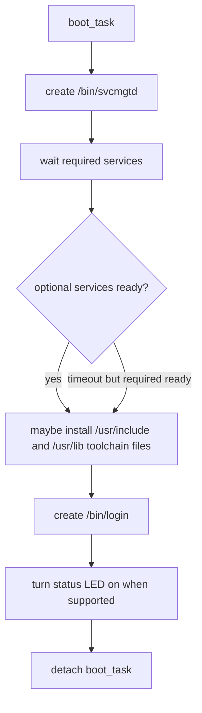

# Boot and Architecture

Rk-C is a Nim-based RISC-V 64-bit microkernel-style system. The main development target is QEMU `virt`, and the current real-board bring-up target is Milk-V Duo 256M. Both boot through OpenSBI and enter the kernel in S-mode.

## High-Level Boot Flow

```text
OpenSBI
  -> src/arch/riscv64/boot.S
  -> kernel_main
  -> kernelBootstrap()
  -> runtime setup
  -> filesystem setup
  -> boot_task
  -> svcmgtd
  -> required services
  -> optional services
  -> login
  -> shell
```

The common boot entry is `src/kernel/init/bootstrap.nim`. Platform bring-up diagnostics for Milk-V are compiled behind `milkvBringup`; the normal runtime path is shared and uses platform dispatchers under `src/platform/`.

## Early Runtime Setup

The normal runtime path performs the following sequence:

```text
clear BSS
set trap vector
initialize physical page allocator
initialize process table and TTY state
enable Sv39 kernel identity mappings
initialize filesystem and appfs
enable external interrupts
enable timer interrupts
create boot_task
```

Important implementation entry points:

- `src/kernel/init/runtime_setup.nim`: BSS clear, trap vector, Sv39, interrupt enablement, memory layout reporting.
- `src/kernel/init/bootstrap.nim`: top-level boot sequence selection.
- `src/kernel/init/userland_boot.nim`: service startup, optional hosted toolchain installation, login startup, status LED.

## Boot Task

`boot_task` is a temporary kernel process created after core runtime setup. It starts `svcmgtd`, waits for service readiness, optionally installs hosted toolchain library files, starts `/bin/login`, marks itself detached, and then leaves scheduling to the normal process lifecycle.



The initial service wait uses `requiredServicesReady()` and `allServicesReady()`. Required services must become ready or boot panics. Optional services may time out and the system continues in degraded mode.

## Service Catalog

Service metadata is shared through `src/lib/service_catalog.nim`.

Required services:

- `procmgtd`: process information and kill mediation.
- `blockd`: raw block-device service.
- `fsd`: filesystem service.
- `userd`: passwd, shadow, group, authentication, and password updates.

Optional services:

- `procfsd`: `/proc` virtual filesystem.
- `netd`: network service.

`svcmgtd` itself is the service manager and is started directly by the boot task.

## Platform Startup Policy

The service manager receives platform-selected startup arguments from `src/platform/service_policy.nim`.

- QEMU currently starts `svcmgtd` without extra arguments, so network services are allowed.
- Milk-V Duo 256M currently starts `svcmgtd --no-network`, because the real-board core bring-up currently targets UART, SD, filesystem, login, and shell before Ethernet.

This policy keeps the common service catalog intact while allowing platform-specific boot limits.

## Kernel/User Split

The kernel keeps privileged mechanisms:

- trap and syscall dispatch
- physical page allocation
- Sv39 page table management
- process table and context switching
- TTY state and platform interrupt intake
- IPC queues and packet stamping
- service registry
- raw filesystem and block fallback during early boot
- RKX loading and capability granting

Most policy lives in userspace:

- service lifecycle: `svcmgtd`
- process API: `procmgtd`
- block I/O server: `blockd`
- filesystem server: `fsd`
- procfs server: `procfsd`
- user database and authentication: `userd`
- network stack: `netd`

## Address and Platform Notes

The common linker still places the kernel at `0x80200000`. QEMU and Milk-V each provide memory, MMIO, RTC, block, interrupt, timer, shutdown, and status LED backends through dispatcher files in `src/platform/`.

The platform split is intentional: common boot code should call dispatcher modules, while board-specific register sequences stay in `src/platform/qemu_virt/` or `src/platform/milkv_duo256m/`.
