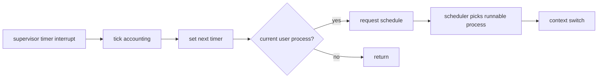

# Process, Scheduler, and Lifecycle

Rk-C uses a fixed-size process table with preemptive scheduling driven by timer interrupts. The current table size is exposed to userspace as `SysProcessMaxSlots`.

## Process Structure

The kernel process object tracks:

- PID and PPID
- process state
- kernel/user mode
- executable path
- UID and GID
- current working directory
- file descriptor table
- pipe references
- TTY association
- user image mapping metadata
- heap start and heap pages
- requested and effective capability masks
- pending signals
- IPC queue state
- wait state
- CPU tick accounting

User-related fields and IPC-related fields are grouped into nested objects to keep the top-level process structure readable as the feature set grows.

## States

```text
unused
  -> runnable
  -> running
  -> sleeping
  -> zombie
  -> unused
```

`zombie` means the process has exited but its parent has not reaped it yet. Detached processes are auto-reaped so background service helpers do not leak slots indefinitely.

## Scheduling

Timer interrupts update accounting and request preemption. The scheduler selects runnable processes and switches context through the RISC-V context assembly path.



The scheduler also supports explicit `yield`, sleeping until a tick, sleeping for process exit, sleeping for TTY input, and polling on multiple event types.

## Wait State

Blocking reasons are represented through a generic wait state rather than many unrelated boolean fields. Wake paths use targeted wake helpers for:

- PID exit
- TTY input
- IPC receive
- timer deadline
- pipe read/write availability
- signal delivery

This avoids scanning with unrelated condition checks in hot paths and keeps future wait kinds extensible.

## Fork-Like Exec Foundation

Command execution uses a fork-like foundation: child process metadata inherits from the parent, then the executable image is replaced with the target RKX image.

Inherited state includes:

- UID and GID
- cwd
- root service assumptions
- file descriptors
- TTY
- selected process metadata used by future multi-user/container work

This is why shell pipelines and redirection can work through `pipe` and `dup2` style FD setup before executing the target program.

## Lifecycle

Important lifecycle paths:

- `exec`: create a user process from an RKX image.
- `exec_as`: create a user process with a selected UID/GID, used by login and root-mediated flows.
- `exit`: mark a process zombie and publish status.
- `wait`: reap a child zombie and release resources.
- `kill`: mediated through procmgtd for normal userland and checked by capability policy.
- `discardProcess`: release address space, kernel stack, pipes, fd table, IPC state, and accounting data.

Service PIDs are protected from unauthorized kill paths. `svcmgtd` owns restart policy for managed services.

## Process Observability

Process state is visible through:

- `ps`
- `ps -f`
- `ps -l`
- `ps -e`
- `/proc/processes`
- `/proc/<pid>/status`
- `/proc/<pid>/rkx_map`

Process list output is sorted by PID for stable developer diagnostics.

## Design Constraints

- Do not add one-off scheduler behavior for a single platform bring-up case.
- Keep process metadata inheritance explicit.
- Keep process cleanup complete before increasing `SysProcessMaxSlots`.
- Prefer targeted wake lists or indexed waits when adding new wait-heavy subsystems.
